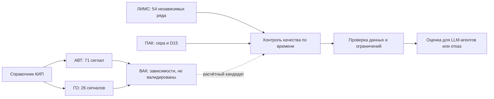

[Карта данных](%D0%9A%D0%B0%D1%80%D1%82%D0%B0%20%D0%B4%D0%B0%D0%BD%D0%BD%D1%8B%D1%85.md)

# Связи и синхронизация

## Что можно связать точно

| Связь | Ключ | Статус |
| --- | --- | --- |
| CSV -> КИП | stage + tag | Точное совпадение 97 кодов; смысл и единицы всё ещё требуют проверки |
| CSV АВТ -> CSV ГО | date + префиксы колонок | Одинаковые временные метки; это общее время, не одна порция продукта |
| Формула -> короткий тег | Блок установки + токен формулы | Синтаксическое соответствие; физическая валидность формулы неизвестна |
| ЛИМС -> карточка ряда | Точка + parameter + пара колонок | Однозначная идентичность исходного ряда |
| ПАК -> ЛИМС ГО-2 | Свойство + согласование времени | Кандидат; точная линия, задержки и ppm требуют подтверждения |
| ЛИМС АВТ -> фракции ВАК | Таблица соответствий не выдана | Не установлено |
| ГО-2 -> товарный бленд | Рецептуры/трассировка не выданы | Только сценарное допущение |



Стрелки показывают использование данных, не подтверждённые трубопроводы.

## Причинно корректное объединение

В момент решения t доступны только записи с available_at <= t. Признаки телеметрии: лаги и окна с правой границей не позже t. Последний анализ ищется назад по времени его доступности, с ограничением возраста; отдельно сохраняется event_time. Переносить значение вперёд допустимо как последнее известное состояние с возрастом, но не как новые независимые целевые метки.

Для оценки качества в момент пробы можно ретроспективно привязать лабораторную метку к телеметрии до пробы. Эту же метку нельзя одновременно использовать как уже известный вход на момент пробы без доказательства доступности. Для прогноза на горизонт h целевой анализ находится после t, а все признаки остаются из прошлого t.

`nearest` и `bfill` могут подмешать будущее. Ограниченный backward join сам по себе не решает отсутствующий available_at. Дедупликацию, масштабирование, отбор признаков и подбор задержек проводить внутри train-периода; test отделить по времени.

## Пример статуса состояния

```text
decision_time: момент решения
telemetry: значения до decision_time + возраст + флаги
lab: последняя доступная проба + event_time + available_at
pak: последнее значение + возраст + длительность неизменности
assumptions: версия задержек и единиц
result: пригодно / ограниченно / отказ + причины
```

Конкретные задержки и допустимые возраста ещё не согласованы. [Q03-Время-и-доступность](%D0%9D%D0%B5%D0%BE%D0%BF%D1%80%D0%B5%D0%B4%D0%B5%D0%BB%D1%91%D0%BD%D0%BD%D0%BE%D1%81%D1%82%D0%B8/Q03-%D0%92%D1%80%D0%B5%D0%BC%D1%8F-%D0%B8-%D0%B4%D0%BE%D1%81%D1%82%D1%83%D0%BF%D0%BD%D0%BE%D1%81%D1%82%D1%8C.md).
