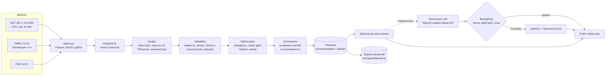

# Архитектура решения

Данные проходят воспроизводимую обработку, затем роли агентов по очереди оценивают
качество, надёжность и варианты действий. Оркестратор разрешает конфликты и проверяет
согласованность. Только после того, как решение окончательно, строится объяснение.
Необязательная локальная LLM может переформулировать объяснение, но не видит ничего,
кроме готового решения, и не может его изменить.

## Роли

| Роль | Потребляет | Производит | Код |
|---|---|---|---|
| Quality | snapshot, прогноз | базовая сера (ЛИМС → ПАК → nowcast), прогноз, T95/цетан, сравнение анализаторов | `backend/agents.py::QualityAgent`, `backend/forecast.py` |
| Reliability | данные Quality | жёсткие проверки свежести и флагов, область применимости, режим пуска/останова, индекс нагрузки | `ReliabilityAgent`, `backend/objectives.py` |
| Optimization | Quality, Reliability, сценарная модель | кандидаты hold/conservative/automatic/экономичные/смеси, safety gate, аннотация Парето, выбор | `OptimizationAgent`, `backend/scenarios.py` |
| Orchestrator | все роли | конфликты целей и их разрешение, проверки согласованности, итог и trace | `Orchestrator` |
| Explainer | готовое решение | шаблонное объяснение; при включении — проверенный пересказ LLM | `backend/explain.py`, `backend/llm.py` |

## Разрешение конфликтов

Приоритет: жёсткие ограничения качества → надёжность режима → экономика.

| Код | Когда | Разрешение |
|---|---|---|
| `analyser_disagreement` | свежие ПАК и Q21 расходятся > 2 мг/кг | отказ: база серы не подтверждена |
| `quality_vs_reliability` | цель по сере достигается только вариантами за пределом нагрузки | другой допустимый вариант или отказ |
| `economy_vs_quality` | экономичные варианты нарушают предел серы | приоритет качества |
| `stability_vs_economy` | выигрыш от изменения меньше `minimum_economic_gain` | удержание режима |

Проверки согласованности: все кандидаты рассчитаны на момент решения, признаки прогноза
не позже него, выбранный вариант прошёл все проверки и совпадает с рекомендацией, сера
варианта и смеси ≤ 10 мг/кг, сумма долей смеси = 100%. Любая непройденная проверка
превращает решение в отказ.

## LLM-объяснитель

- Выключен по умолчанию. Включается переменными `OILCODE_LLM_BASE_URL` и `OILCODE_LLM_MODEL`
  (необязательно `OILCODE_LLM_API_KEY`, `OILCODE_LLM_TIMEOUT_S`, `OILCODE_LLM_MAX_TOKENS`).
- Любой OpenAI-совместимый сервер: Ollama, vLLM, llama.cpp server, LM Studio или шлюз
  закрытой сети. Класс моделей из уточнений организаторов — до ~30B (`gpt-oss-20b`, Qwen ~27B);
  для ноутбука достаточно `qwen2.5:3b-instruct`.
- Модель получает только компактный JSON готового решения (`backend/llm.py::facts`).
- Ответ принимается, если каждое число в нём есть в решении (с учётом округления), при
  отказе нет советов по изменению режима, а изменяемые теги (или удержание) названы.
  Иначе, а также при таймауте или ошибке, возвращается шаблон с `fallback_reason`.
- Промпт, ответ, задержка и результат проверки сохраняются в журнале решений.
- Тесты `tests/test_llm_explainer.py` доказывают, что решение с LLM и без неё совпадает.

## Журнал решений

Каждый `POST /api/datasets/{id}/decision` сохраняется в `storage/<id>/decisions/<id>.json`:
запрос, полный ответ с trace и ревизия кода. `GET /api/datasets/{id}/decisions` — список,
`GET /api/datasets/{id}/decisions/{record_id}` — запись. `OILCODE_DECISION_LOG=0` отключает запись.

## Прогноз

Runtime — калиброванный по опубликованным ЛИМС Ridge v3
(`reports/modeling/causal-anchored/corrected-claude/model.json`). Исправленная двухступенчатая
модель v4r доступна только как теневой вариант: `OILCODE_FORECAST_MODEL=two-stage-v4r`.
Почему она не продвинута: [reports/review/v4-repair-2026-09-22/README.md](../reports/review/v4-repair-2026-09-22/README.md).
