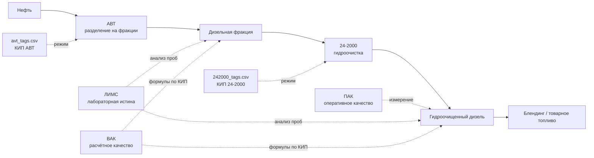
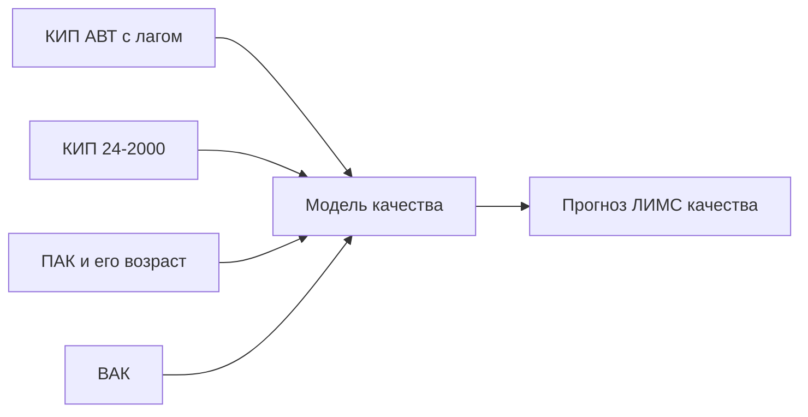

# Нефтекод — данные, технологическая цепочка и модели

## Главное за минуту



> [!important]
> `242000_tags.csv` — **не ПАК**. Это КИП-телеметрия установки 24-2000. ПАК — отдельный Excel с серой и плотностью.

Приоритет источников качества: **ЛИМС → ПАК → ВАК**.

- **ЛИМС** — редкий, запаздывающий, но контрольный лабораторный анализ.
- **ПАК** — частый физический анализатор в потоке.
- **ВАК** — формула или модель, которая вычисляет качество по КИП.
- **КИП** — температуры, давления, расходы, уровни и другие технологические сигналы.

## Назначение файлов

| Файл | Содержимое | Как использовать |
|---|---|---|
| `ТЗ_нефтекод.docx` | Требования, ограничения, сценарии демонстрации | Источник постановки задачи |
| `АВТ_схемы.pdf` | Схема колонн, печей, потоков и регуляторов АВТ | Понимание физического смысла сигналов АВТ |
| `data/avt_tags.csv` | 71 сигнал КИП АВТ, шаг 10 минут | Признаки режима первой стадии |
| `data/242000_tags.csv` | 26 сигналов КИП гидроочистки, шаг 10 минут | Признаки режима второй стадии |
| `ЛИМСы …xlsx` | Лабораторные результаты по 6 точкам отбора | Основные целевые значения качества |
| `Выгрузка ПАК …xlsx` | Поточная сера и расчётная D15 | Частые оперативные цели/признаки качества |
| `Теги_хакатон.xlsx` | Справочники ЛА, ВАК, ПАК и КИП | Расшифровка всех источников |
| `data.rar` | Архив тех же двух CSV | Резервная копия, отдельно обрабатывать не нужно |
| `~$_нефтекод.docx` | Временный lock-файл Word | Игнорировать |

## Разница между АВТ и 24-2000

| | АВТ | 24-2000 |
|---|---|---|
| Этап | Начало цепочки | После АВТ |
| Задача | Разделить нефть на фракции по температурам кипения | Удалить серу из дизельной фракции, стабилизировать продукт |
| Вход | Обессоленная нефть | Дизельная фракция с АВТ |
| Выход | Бензин, керосин, дизельные и тяжёлые фракции | Гидроочищенное дизельное топливо |
| Данные | `avt_tags.csv` | `242000_tags.csv` |
| Основные группы сигналов | Колонны К-1, К-2, К-10; печи; отборы фракций | Реакторы Р-201/Р-202; стабилизация; сырьё, квенч, газ, продукт |

Изменение АВТ влияет на состав дизельной фракции, а значит позже влияет на нагрузку и качество на 24-2000. Это влияние может иметь **временную задержку**. Нельзя автоматически считать, что АВТ в `12:00` вызвала результат 24-2000 ровно в `12:00`.

## Что означают сигналы CSV

Обе таблицы имеют общий ключ `date`. Строка — состояние установки в конкретный 10-минутный момент.

`Unnamed: ...` — служебные индексы, их следует удалить.

Типичные буквы:

| Префикс | Обычно означает | Примеры |
|---|---|---|
| `T` | Температура | верх/низ колонны, выход печи, реактор |
| `P` | Давление или вакуум | давление колонны, реактора |
| `F` | Расход | сырьё, продукт, пар, орошение |
| `L` | Уровень | уровень жидкости в аппарате |
| `W` | Массовый расход или иной сигнал | уточнять по справочнику |
| `D` | Плотность | уточнять по справочнику |
| `Q` | Специальный технологический сигнал | уточнять по справочнику |

> [!warning]
> Буква — только подсказка. В наборе встречаются обезличенные/нестандартные обозначения. Истиной является лист `КИП` в `Теги_хакатон.xlsx`.

### Примеры АВТ

| Тег | Смысл | Где на схеме |
|---|---|---|
| `T1` | Температура верха К-1 | Верх колонны К-1 |
| `F3` | Расход бензина на орошение К-1 | Контур возврата в К-1 |
| `T33` | Температура низа К-2 | Низ атмосферной колонны К-2 |
| `F30` | Расход фракции 290–350 °C | Один из дизельных отборов К-2 |
| `F32` | Расход фракции 240–290 °C | Один из дизельных отборов К-2 |
| `L43` | Уровень в К-10 | Вакуумная колонна К-10 |
| `P44` | Вакуум низа К-10 | Низ К-10 |
| `T55` | Температура на выходе П-3 | Печь перед К-10 |

### Примеры 24-2000

| Тег | Смысл |
|---|---|
| `T5` | Температура газосырьевой смеси на выходе Р-201 |
| `W10` | Перепад давления на Р-202 |
| `F15` | Расход квенча в Р-202 |
| `F17` | Расход гидроочищенного дизеля с установки |
| `F25` | Показание ВАК температуры вспышки |
| `F26` | Объёмный расход сырья |

В приложенной PDF есть схема АВТ. Полной схемы 24-2000 в пакете нет, поэтому её сигналы связываются с процессом по листу `КИП`, а не по PDF.

## Зачем в справочнике четыре листа

| Лист | Что описывает | Связь с фактическими файлами |
|---|---|---|
| `КИП` | Расшифровка `T1`, `F30`, `W10` и остальных сигналов | Колонки двух CSV |
| `ЛА` | Какие лабораторные показатели доступны в каждой точке отбора | Заголовки и группы колонок файла ЛИМС |
| `ПАК` | Какие поточные анализаторы выданы и их полные названия | Колонки файла ПАК |
| `ВАК` | Готовые формулы расчётного качества | Используют колонки CSV как входы |

То есть CSV содержит только историю КИП, а остальные листы нужны для интерпретации и восстановления показателей **качества**, которых в CSV напрямую нет.

## Как устроен ЛИМС

В первой строке указана точка отбора. Заголовок объединён над несколькими показателями.

Далее каждый показатель хранится собственной парой:

```text
дата измерения | значение | дата другого измерения | значение | ...
```

Пары независимы. Например, серу могли измерить сегодня, плотность вчера, а цетановое число неделю назад. Строки ЛИМС нельзя связывать со строками CSV по номеру.

Основные точки:

- АВТ: точки 1, 2, 2.1 и 3 — разные потоки/точки отбора дизельных фракций;
- гидроочистка, точка 1 — промежуточная/входная дизельная фракция;
- гидроочистка, точка 2 — гидроочищенное дизельное топливо, главный выходной продукт.

Основные показатели:

| Поле | Значение |
|---|---|
| `Mg.Sulfur` | Сера, мг/кг |
| `Mass.Sulfur` | Сера, массовая доля |
| `D15` | Плотность при 15 °C |
| `IBP.T` / `EBP.T` | Начало / конец кипения |
| `50%.T`, `90%.T`, `95%.T` | Температура выкипания указанной доли продукта |
| `I250`, `I350` | Доля, выкипающая до 250/350 °C |
| `CloudPoint` | Температура помутнения |
| `CFPP` | Предельная температура фильтруемости |
| `PourPoint` | Температура потери текучести/застывания |
| `FlashPoint` | Температура вспышки |
| `CetaneNumber` | Цетановое число |

В исходном ЛИМС есть ошибочные подписи единиц: некоторые температурные поля подписаны как `кг/м3`, а D15 местами как `°C`. Эксперт подтвердил нормализацию по названию показателя; исправления зафиксированы в реестре.

## Как устроен ПАК

В Excel находятся две независимые пары колонок:

| Колонки | Показатель | Периодичность/покрытие |
|---|---|---|
| A:B | `24-2000:Mg.Sulfur`, ppm | Почти 10-минутный ряд с 2023 года |
| D:E | `24-2000:D15`, кг/м³ | Доступен только с марта 2025 года |
| C | Пустой разделитель | Не использовать |

Строка A100/B100 не обязана соответствовать D100/E100: у серы и плотности собственные временные ряды.

Эксперт подтвердил: ПАК соответствует `Mg.Sulfur` гидроочистки, точка 2, и для массовой серы `1 ppm = 1 мг/кг`.

## Как объединять данные

1. Очистить `date`, удалить `Unnamed`.
2. Соединить АВТ и 24-2000 по точному 10-минутному времени.
3. Каждую пару ЛИМС и ПАК преобразовать в длинный формат:

```text
timestamp | source | sample_point | metric | value | unit
```

4. Метка ЛИМС — момент отбора; для момента `t` брать последнее измерение, отобранное не позже `t-4 часа`.
5. Добавлять время доступности и `age_minutes = t - timestamp_отбора`.
6. Не подставлять будущий лабораторный анализ к прошлой телеметрии.
7. Для связи АВТ → 24-2000 проверить лаги: например 0, 30, 60, 120 минут и выбрать их только по временной валидации/технологическому смыслу.

Пример итоговой строки признаков:

```text
time
+ КИП АВТ в time - lag
+ КИП 24-2000 в time
+ последний ПАК до time
+ последний ЛИМС до time
+ возраст ПАК/ЛИМС
+ результаты ВАК
```

## Что является эталоном

### Эталон качества

**ЛИМС точки 2 гидроочистки** — основной эталон готового гидроочищенного дизеля.

- Для серы: `Mg.Sulfur`, жёсткий предел из ТЗ — **≤ 10 мг/кг**.
- Для других свойств: ЛИМС даёт фактические значения, но допустимые пределы должны прийти из спецификации или явно описанного сценария.
- Если промышленного предела в материалах нет, исторический min/max нельзя называть нормативом.

### Эталон нормального режима оборудования

В пакете нет разметки аварий, отказов и подтверждённых промышленных границ большинства сигналов. Поэтому настоящего эталона надёжности нет.

Допустимо построить **модельный нормальный диапазон** по устойчивым историческим периодам и прямо назвать его прокси, а не промышленным ограничением.

## Как искать аномалии

Разделять минимум три класса:

| Класс | Что означает | Примеры |
|---|---|---|
| Ошибка данных/датчика | Измерение недостоверно | пропуск, скачок, зависание, невозможное значение |
| Аномалия процесса | Необычное сочетание КИП | температуры нормальны по отдельности, но их баланс необычен |
| Риск качества | Продукт выходит к спецификации | сера приближается к 10 мг/кг |

### Минимальные проверки датчика

- пропуск или дублирование времени;
- `NaN`, бесконечность;
- flatline: значение почти не меняется слишком долго;
- слишком быстрый скачок `abs(x[t] - x[t-1])`;
- выход за физически возможные или подтверждённые границы;
- расхождение связанных сигналов: расход есть, а оборудование/температурный отклик отсутствует;
- ПАК резко расходится со свежим ЛИМС;
- несколько соседних датчиков меняются несогласованно.

Если реальных границ нет, использовать устойчивую статистику на обучающем периоде:

```text
robust_z = |x - median| / (1.4826 × MAD)
```

Дополнительно: rolling median, IQR/квантили, Isolation Forest. Порог подбирается на прошлом периоде и проверяется на будущем. Такой порог называется **историческим/model envelope**, не пределом безопасности.

## Какие модели обучать

### Агент качества

Практичная схема:

1. Основной supervised target — ЛИМС гидроочистки, точка 2.
2. Признаки — КИП 24-2000, лаги/rolling-статистики, часть КИП АВТ с транспортным лагом, возраст анализов.
3. ПАК серы можно использовать как частый промежуточный target или дополнительный признак.
4. ВАК использовать как готовый baseline и/или дополнительные признаки.
5. Финальную точность и риск нарушения спецификации оценивать на отложенном по времени ЛИМС.



Не следует проверять качество модели только на ПАК или ВАК: ПАК может иметь систематическую ошибку, ВАК сам является расчётной моделью.

### Агент надёжности

Обучить честную supervised-модель отказов нельзя: меток аварий/отказов нет.

Использовать:

- правила качества датчиков;
- индекс тяжести режима по температуре, давлению, перепаду и нагрузке;
- отклонение от устойчивого исторического режима;
- multivariate anomaly detection;
- объяснение факторов риска.

Результат агента — `норма / внимание / высокий риск`, contributing factors и уверенность. Это прокси-оценка, а не вероятность реальной аварии.

## Правильная схема обучения и проверки

```text
Прошлый период       → обучение
Следующий период     → валидация и подбор параметров
Самый поздний период → финальный тест и демонстрационные сценарии
```

Случайный `train_test_split(shuffle=True)` использовать нельзя: он переносит информацию из будущего в прошлое.

Рекомендуемый подход по сере:

```text
ПАК — много частых меток → предварительная модель / nowcasting
ЛИМС — мало точных меток → калибровка и финальная проверка
ВАК — готовый baseline  → сравнение и дополнительный признак
```

## Что может менять оптимизатор

Не каждый столбец CSV является управляющим воздействием. Для гидроочистки эксперт подтвердил три воздействия: `P8` — температура ГСС на входе Р-202, `T11` — массовый расход сырья, `F19` — давление на входе Р-202. Ограничений скорости не дано; лаг отклика нужно оценивать в пределах 0–3 часов.

Кандидат можно считать управляемым, если:

1. он связан с регулятором/управляемым контуром на схеме или подтверждён описанием;
2. понятен его физический эффект;
3. для него задан безопасный модельный диапазон;
4. модель умеет оценить последствие изменения;
5. допущение документировано.

Оптимизатор предлагает небольшие изменения, пересчитывает качество и риск, затем отбрасывает варианты с серой > 10 мг/кг или с выходом за ограничения.

## Минимальный рабочий pipeline

- [ ] Преобразовать все источники во временной формат.
- [ ] Построить таблицу метаданных тегов из листа `КИП`.
- [ ] Нормализовать единицы и записать все исправления.
- [ ] Сделать as-of join ЛИМС/ПАК без будущих значений.
- [ ] Добавить возраст каждого анализа.
- [ ] Найти устойчивые периоды и построить базовые проверки аномалий.
- [ ] Выбрать один главный target: сера выходного дизеля.
- [ ] Сравнить baseline ВАК, простую модель и ML-модель.
- [ ] Валидировать только по времени и отдельно по ЛИМС.
- [ ] Сделать агент надёжности как объяснимый proxy-risk.
- [ ] Показать норму, риск качества, аномальные данные и безопасный отказ.

## Что известно и что неизвестно

**Подтверждено материалами и ответами эксперта:** прямое соответствие CSV листу `КИП` без масштабирования, единый часовой пояс, структура файлов, приоритет ЛИМС/ПАК/ВАК, задержка ЛИМС до 4 часов, ограничение серы, три управляющих тега гидроочистки, шаг рекомендаций 15–60 минут и горизонт 0–3 часа.

**Нужно оценить:** конкретные лаги в диапазоне 0–3 часов, сроки устаревания ЛИМС/ПАК, коэффициенты чувствительности и устойчивые исторические режимы.

**Не дано:** рецептуры и расходы промышленного блендинга, подтверждённые пределы большинства КИП, метки отказов оборудования и эффективность цетаноповышающей присадки. Для модельного блендинга обязательны сера, T95 и цетановое число; доля присадки ограничена 3%, индекс её стоимости относительно ДТ равен 100.
